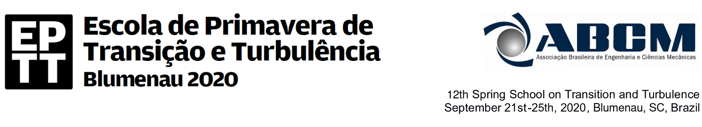
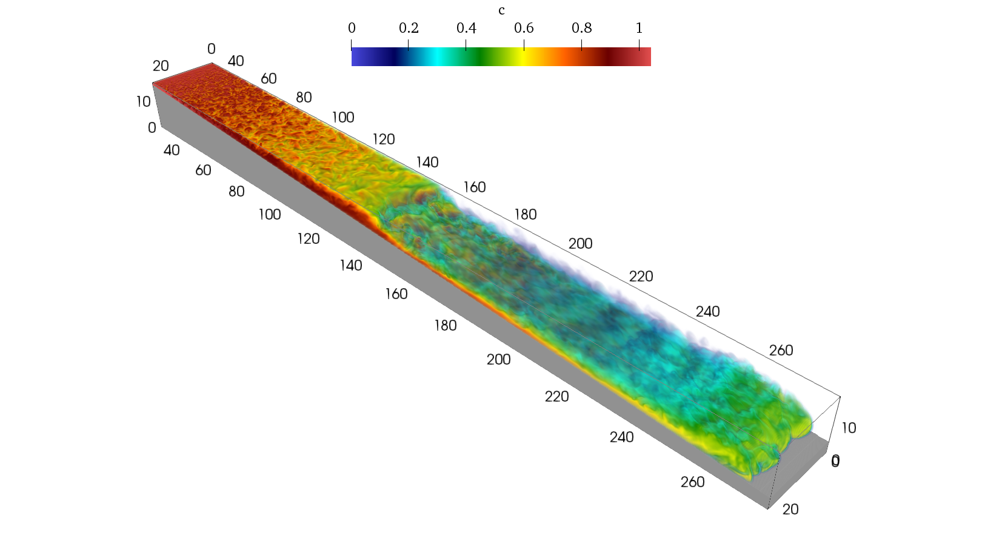

# The Plunging of Hyperpycnal Plumes on Tilted Bed by Three-Dimensional Large-Eddy Simulations

> **Felipe Nornberg Schuch**  
> **Jorge Hugo Silvestrini**  
> *School of Technology, Pontifical Catholic University of Rio Grande do Sul, Porto Alegre, Brazil.*  
> felipe.schuch@edu.pucrs.br, jorgehs@pucrs.br  
>  
> **Eckart Meiburg**  
> *Department of Mechanical Engineering, University of California Santa Barbara, Santa Barbara, USA*  
> meiburg@engineering.ucsb.edu  
>  
> **Sylvain Laizet**  
> *Department of Aeronautics, Imperial College London, London, SW7 2AZ, UK*  
> s.laizet@imperial.ac.uk  
>  
> **Abstract:** Theoretical and experimental interest in the transport and deposition of sediments from rivers to oceans has increased rapidly over the last two decades. The marine ecosystem is strongly affected by mixing at river mouths, with for instance anthropogenic actions like pollutant spreading. Particle-laden flows entering a lighter ambient fluid (hyperpycnal flows) can plunge at a sufficient depth, and their deposits might preserve a remarkable record across a variety of climatic and tectonic settings. Numerical simulations play an essential role in this context since they provide information on all flow variables for any point of time and space. This work offers valuable Spatio-temporal information generated by turbulence-resolving 3D simulations of poly-disperse hyperpycnal plumes over a tilted bed. The simulations are performed with the high-order flow solver [Xcompact3d](https://github.com/xcompact3d/Incompact3d), which solves the incompressible Navier-Stokes equations on a Cartesian mesh using high-order finite-difference schemes. Five cases are presented, with different values for flow discharge and sediment concentration at the inlet. A detailed comparison with experimental data and analytical models is already available in the literature. The main objective of this work is to present a new data-set that shows the entire three-dimensional Spatio-temporal evolution of the plunge phenomenon and all the relevant quantities of interest.
>  
> **Keywords:** Turbidity Current, Plunging Flow, Computational Fluid Dynamics, Large-Eddy Simulation, Xcompact3d.



* Publication (PDF): To appear soon at conference proceedings.
* Flow visualization: https://youtu.be/rUDY5UI0bG4
* Talk: https://youtu.be/n08U9l1Pgis

## Simulations

Five poly-disperse simulations with 3 grain sizes based on the experimental set-up and the numerical configuration of:

* Lamb, M.P., McElroy, B., Kopriva, B., Shaw, J. and Mohrig, D., 2010. "Linking river-flood dynamics to hyperpycnal plume deposits: Experiments, theory, and geological implications". [Geological Society of America Bulletin, Vol. 122, No. 9-10, pp. 1389–1400](https://doi.org/10.1130/B30125.1);

* Schuch, F.N., Pinto, L.C., Silvestrini, J.H. and Laizet, S., 2018. "Three-dimensional turbulence-resolving simulations of the plunge phenomenon in a tilted channel". [Journal of Geophysical Research: Oceans, Vol. 123, pp. 1–13](https://doi.org/10.1029/2018JC014027).

| Cases | 2 | 4 | 5 | 6 | 7 |
|-------|---|---|---|---|---|
| Inflow Discharge (m²/s) | 0.0046 | 0.0025 | 0.0033 | 0.0043 | 0.0043 |
| Volumetric particle concentration (%) | 0.36 | 0.54 | 0.54 | 0.54 | 1.00 |
| Reynolds Number | 4,300 | 2,500 | 3,300 | 4,300 | 4,300 |
| Initial densimetric Froude Number | 17.81 | 8.45 | 11.16 | 14.54 | 11.68 |


## Dataset [](https://doi.org/10.5281/zenodo.3968993)

Data from the five simulations are included (cases 2, 4, 5, 6, and 7). The output files from Xcompact3d were converted to [NetCDF](https://www.unidata.ucar.edu/software/netcdf/) aiming to be more friendly than raw binaries, they include data arrays together with metadata and the coordinates:

* `n`: Particle fractions, three were used for the poly-dispersed simulations;
* `t`: Time;
* `x`: Streamwise coordinate;
* `y`: Vertical coordinate;
* `z`: Spanwise coordinate;

Due to limitations at the storage size, the time sampling is smaller for larger arrays. There are four files for each simulated case:

* `3d-case-<num>.nc`: Complete 3D snapshot at 12 different dimensionless times (250, 500, 750, 1,000, 1,250, 1,500, 1,750, 2,000, 3,000, 4,000, 5,000, 6,000), the arrays are:
  - `ux (x,y,z,t)`: Streamwise velocity;
  - `uy (x,y,z,t)`: Vertical velocity;
  - `uz (x,y,z,t)`: Spanwise velocity;
  - `phi (x,y,z,n,t)`: Concentration.
* `xy-planes-case-<num>.nc`: Spanwise-averaged quantities with a timestep of 5 dimensionless units:
  - `ux (x,y,t)`: Streamwise velocity;
  - `uy (x,y,t)`: Vertical velocity;
  - `uz (x,y,t)`: Spanwise velocity;
  - `phi (x,y,n,t)`: Concentration.
* `xz-planes-case-<num>.nc`: Depth-averaged quantities with a timestep of 5 dimensionless units:
  - `ux (x,z,t)`: Streamwise velocity;
  - `uy (x,z,t)`: Vertical velocity;
  - `uz (x,z,t)`: Spanwise velocity;
  - `phi (x,z,n,t)`: Concentration.
* `LA-case-<num>.nc`: The complete spatio-temporal analysis of the relevant quantities is possible in a layer-averaged context per width unit, it is based on three variables:
  - `Layer-averaged Uh (x,t)`;
  - `Layer-averaged U2h (x,t)`;
  - `Layer-averaged UCh (x,n,t)`;

  that can be used to compute layer-averaged velocity `U = U2h/Uh`, flow depth `H = (Uh)²/U2h`, flow discharge `Q = Uh`, concentration `C = UCh/Uh` and local densimetric Froude number `Fr`. In addition to:
  - `utau (x,t)`: Spanwise-averaged bed shear velocity;
  - `dep (x,n,t)`: Spanwise-averaged deposition rate.

  All arrays with a timestep of 2.5 dimensionless units.

Each file can be loaded with the Python package [xarray](http://xarray.pydata.org/en/stable/) (see [Why xarray](http://xarray.pydata.org/en/stable/why-xarray.html)), for instance:

```python
dataset = xr.load_dataset("filename")
```
